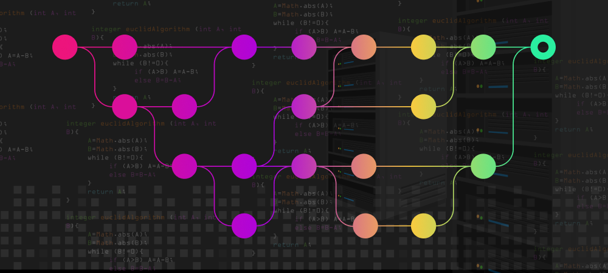

<div align="center">

# Froggit-Go

[](#readme)
</div>

Froggit-Go is a Go library, allowing to perform actions on VCS providers.
Currently supported providers are: [GitHub](#github), [Bitbucket Server](#bitbucket-server)
, [Bitbucket Cloud](#bitbucket-cloud), [Azure Repos](#azure-repos) and [GitLab](#gitlab).

## Project status

[](https://github.com/jfrog/froggit-go/actions/workflows/test.yml) [](https://coveralls.io/github/jfrog/froggit-go?branch=master) [](https://github.com/avelino/awesome-go) [](https://goreportcard.com/report/github.com/jfrog/froggit-go)

## Usage

- [Froggit-Go](#froggit-go)
  - [Project status](#project-status)
  - [Usage](#usage)
    - [VCS Clients](#vcs-clients)
      - [Create Clients](#create-clients)
        - [GitHub](#github)
        - [GitLab](#gitlab)
        - [Bitbucket Server](#bitbucket-server)
        - [Bitbucket Cloud](#bitbucket-cloud)
        - [Azure Repos](#azure-repos)
      - [Test Connection](#test-connection)
      - [List Repositories](#list-repositories)
      - [List Branches](#list-branches)
      - [Download Repository](#download-repository)
      - [Create Webhook](#create-webhook)
      - [Update Webhook](#update-webhook)
      - [Delete Webhook](#delete-webhook)
      - [Set Commit Status](#set-commit-status)
        - [Create Pull Request](#create-pull-request)
      - [List Open Pull Requests](#list-open-pull-requests)
        - [Add Pull Request Comment](#add-pull-request-comment)
        - [List Pull Request Comments](#list-pull-request-comments)
      - [Get Latest Commit](#get-latest-commit)
      - [Get Commit By SHA](#get-commit-by-sha)
      - [Add Public SSH Key](#add-public-ssh-key)
      - [Get Repository Info](#get-repository-info)
      - [Create a label](#create-a-label)
      - [Get a label](#get-a-label)
      - [List Pull Request Labels](#list-pull-request-labels)
      - [Unlabel Pull Request](#unlabel-pull-request)
      - [Upload Code Scanning](#upload-code-scanning)
      - [Download a File From a Repository](#download-a-file-from-a-repository)
    - [Webhook Parser](#webhook-parser)

### VCS Clients

#### Create Clients

##### GitHub

GitHub api v3 is used

```go
// The VCS provider. Cannot be changed.
vcsProvider := vcsutils.GitHub
// API endpoint to GitHub. Leave empty to use the default - https://api.github.com
apiEndpoint := "https://github.example.com"
// Access token to GitHub
token := "secret-github-token"
// Logger
// [Optional]
// Supported logger is a logger that implements the Log interface. 
// More information - https://github.com/jfrog/froggit-go/blob/master/vcsclient/logger.go
logger := log.Default()

client, err := vcsclient.NewClientBuilder(vcsProvider).ApiEndpoint(apiEndpoint).Token(token).Build()
```

##### GitLab

GitLab api v4 is used.

```go
// The VCS provider. Cannot be changed.
vcsProvider := vcsutils.GitLab
// API endpoint to GitLab. Leave empty to use the default - https://gitlab.com
apiEndpoint := "https://gitlab.example.com"
// Access token to GitLab
token := "secret-gitlab-token"
// Logger
// [Optional]
// Supported logger is a logger that implements the Log interface. 
// More information - https://github.com/jfrog/froggit-go/blob/master/vcsclient/logger.go
logger := logger

client, err := vcsclient.NewClientBuilder(vcsProvider).ApiEndpoint(apiEndpoint).Token(token).Build()
```

##### Bitbucket Server

Bitbucket api 1.0 is used.

```go
// The VCS provider. Cannot be changed.
vcsProvider := vcsclient.BitbucketServer
// API endpoint to Bitbucket server. Typically ends with /rest.
apiEndpoint := "https://git.acme.com/rest"
// Access token to Bitbucket
token := "secret-bitbucket-token"
// Logger
// [Optional]
// Supported logger is a logger that implements the Log interface. 
// More information - https://github.com/jfrog/froggit-go/blob/master/vcsclient/logger.go
logger := log.Default()

client, err := vcsclient.NewClientBuilder(vcsProvider).ApiEndpoint(apiEndpoint).Token(token).Build()
```

##### Bitbucket Cloud

Bitbucket cloud api version 2.0 is used and the version should be added to the apiEndpoint.

```go
// The VCS provider. Cannot be changed.
vcsProvider := vcsutils.BitbucketCloud
// API endpoint to Bitbucket cloud. Leave empty to use the default - https://api.bitbucket.org/2.0
apiEndpoint := "https://bitbucket.example.com"
// Bitbucket username
username := "bitbucket-user"
// Password or Bitbucket "App Password'
token := "secret-bitbucket-token"
// Logger
// [Optional]
// Supported logger is a logger that implements the Log interface. 
// More information - https://github.com/jfrog/froggit-go/blob/master/vcsclient/logger.go
logger := log.Default()

client, err := vcsclient.NewClientBuilder(vcsProvider).ApiEndpoint(apiEndpoint).Username(username).Token(token).Build()
```

##### Azure Repos

Azure DevOps api version v6 is used.

```go
// The VCS provider. Cannot be changed.
vcsProvider := vcsutils.AzureRepos
// API endpoint to Azure Repos. Set the organization.
apiEndpoint := "https://dev.azure.com/<organization>"
// Personal Access Token to Azure DevOps
token := "secret-azure-devops-token"
// Logger
// [Optional]
// Supported logger is a logger that implements the Log interface. 
// More information - https://github.com/jfrog/froggit-go/blob/master/vcsclient/logger.go
logger := log.Default()
// Project name
project := "name-of-the-relevant-project"

client, err := vcsclient.NewClientBuilder(vcsProvider).ApiEndpoint(apiEndpoint).Token(token).Project(project).Build()
```

#### Test Connection

```go
// Go context
ctx := context.Background()

err := client.TestConnection(ctx)
```

#### List Repositories

```go
// Go context
ctx := context.Background()

repositories, err := client.ListRepositories(ctx)
```

#### List Branches

```go
// Go context
ctx := context.Background()
// Organization or username
owner := "jfrog"
// VCS repository
repository := "jfrog-cli"

repositoryBranches, err := client.ListBranches(ctx, owner, repository)
```

#### Download Repository

```go
// Go context
ctx := context.Background()
// Organization or username
owner := "jfrog"
// VCS repository
repository := "jfrog-cli"
// Repository branch
branch := "master"
// Local path in the file system
localPath := "/Users/frogger/code/jfrog-cli"

repositoryBranches, err := client.DownloadRepository(ctx, owner, repository, branch, localPath)
```

#### Create Webhook

```go
// Go context
ctx := context.Background()
// Organization or username
owner := "jfrog"
// The event to watch
webhookEvent := vcsutils.Push
// VCS repository
repository := "jfrog-cli"
// Optional - Webhooks on branches are supported only on GitLab
branch := ""
// The URL to send the payload upon a webhook event
payloadURL := "https://acme.jfrog.io/integration/api/v1/webhook/event"

// token - A token used to validate identity of the incoming webhook.
// In GitHub and Bitbucket server the token verifies the sha256 signature of the payload.
// In GitLab and Bitbucket cloud the token compared to the token received in the incoming payload.
id, token, err := client.CreateWebhook(ctx, owner, repository, branch, "https://jfrog.com", webhookEvent)
```

#### Update Webhook

```go
// Go context
ctx := context.Background()
// Organization or username
owner := "jfrog"
// VCS repository
repository := "jfrog-cli"
// Optional - Webhooks on branches are supported only on GitLab
branch := ""
// The URL to send the payload upon a webhook event
payloadURL := "https://acme.jfrog.io/integration/api/v1/webhook/event"
// A token to validate identity of the webhook, created by CreateWebhook command
token := "abc123"
// The webhook ID returned by the CreateWebhook API, which created this webhook
webhookID := "123"
// The event to watch
webhookEvent := vcsutils.PrCreated

err := client.UpdateWebhook(ctx, owner, repository, branch, "https://jfrog.com", token, webhookID, webhookEvent)
```

#### Delete Webhook

```go
// Go context
ctx := context.Background()
// Organization or username
owner := "jfrog"
// VCS repository
repository := "jfrog-cli"
// The webhook ID returned by the CreateWebhook API, which created this webhook
webhookID := "123"

err := client.DeleteWebhook(ctx, owner, repository, webhookID)
```

#### Set Commit Status

```go
// Go context
ctx := context.Background()
// One of Pass, Fail, Error, or InProgress
commitStatus := vcsclient.Pass
// Organization or username
owner := "jfrog"
// VCS repository
repository := "jfrog-cli"
// Branch or commit or tag on GitHub and GitLab, commit on Bitbucket
ref := "5c05522fecf8d93a11752ff255c99fcb0f0557cd"
// Title of the commit status
title := "Xray scanning"
// Description of the commit status
description := "Run JFrog Xray scan"
// URL leads to the platform to provide more information, such as Xray scanning results
detailsURL := "https://acme.jfrog.io/ui/xray-scan-results-url"

err := client.SetCommitStatus(ctx, commitStatus, owner, repository, ref, title, description, detailsURL)
```

##### Create Pull Request

```go
// Go context
ctx := context.Background()
// Organization or username
owner := "jfrog"
// VCS repository
repository := "jfrog-cli"
// Source pull request branch
sourceBranch := "dev"
// Target pull request branch
targetBranch := "main"
// Pull request title
title := "Pull request title"
// Pull request description
description := "Pull request description"

err := client.CreatePullRequest(ctx, owner, repository, sourceBranch, targetBranch, title, description)
```

#### List Open Pull Requests

```go
// Go context
ctx := context.Background()
// Organization or username
owner := "jfrog"
// VCS repository
repository := "jfrog-cli"

openPullRequests, err := client.ListOpenPullRequests(ctx, owner, repository)
```

##### Add Pull Request Comment

```go
// Go context
ctx := context.Background()
// Organization or username
owner := "jfrog"
// VCS repository
repository := "jfrog-cli"
// Comment content
content := "Comment content"
// Pull Request ID
pullRequestID := 5

err := client.AddPullRequestComment(ctx, owner, repository, content, pullRequestID)
```

##### List Pull Request Comments

```go
// Go context
ctx := context.Background()
// Organization or username
owner := "jfrog"
// VCS repository
repository := "jfrog-cli"
// Pull Request ID
pullRequestID := 5

pullRequestComments, err := client.ListPullRequestComment(ctx, owner, repository, pullRequestID)
```

#### Get Latest Commit

```go
// Go context
ctx := context.Background()
// Organization or username
owner := "jfrog"
// VCS repository
repository := "jfrog-cli"
// VCS branch
branch := "dev"

// Commit information of the latest commit
commitInfo, err := client.GetLatestCommit(ctx, owner, repository, branch)
```

#### Get Commit By SHA

```go
// Go context
ctx := context.Background()
// Organization or username
owner := "jfrog"
// VCS repository
repository := "jfrog-cli"
// SHA-1 hash of the commit
sha := "abcdef0123abcdef4567abcdef8987abcdef6543"

// Commit information of requested commit
commitInfo, err := client.GetCommitBySha(ctx, owner, repository, sha)
```

#### Add Public SSH Key

```go
// Go context
ctx := context.Background()
// Organization or username
owner := "jfrog"
// VCS repository
repository := "jfrog-cli"
// An identifier for the key
keyName := "my ssh key"
// The public SSH key
publicKey := "ssh-rsa AAAA..."
// Access permission of the key: vcsclient.Read or vcsclient.ReadWrite
permission = vcsclient.Read

// Add a public SSH key to a repository
err := client.AddSshKeyToRepository(ctx, owner, repository, keyName, publicKey, permission)
```

#### Get Repository Info

```go
// Go context
ctx := context.Background()
// Organization or username
owner := "jfrog"
// VCS repository
repository := "jfrog-cli"

// Get information about repository
repoInfo, err := client.GetRepositoryInfo(ctx, owner, repository)
```

#### Create a label

Notice - Labels are not supported in Bitbucket

```go
// Go context
ctx := context.Background()
// Organization or username
owner := "jfrog"
// VCS repository
repository := "jfrog-cli"
// Label info
labelInfo := LabelInfo{
  Name:        "label-name",
  Description: "label description",
  Color:       "4AB548",
}
// Create a label
err := client.CreateLabel(ctx, owner, repository, labelInfo)
```

#### Get a label

Notice - Labels are not supported in Bitbucket

```go
// Go context
ctx := context.Background()
// Organization or username
owner := "jfrog"
// VCS repository
repository := "jfrog-cli"
// Label name
labelName := "label-name"

// Get a label named "label-name"
labelInfo, err := client.GetLabel(ctx, owner, repository, labelName)
```

#### List Pull Request Labels

Notice - Labels are not supported in Bitbucket

```go
// Go context
ctx := context.Background()
// Organization or username
owner := "jfrog"
// VCS repository
repository := "jfrog-cli"
// Pull Request ID
pullRequestID := 5

// List all labels assigned to pull request 5
pullRequestLabels, err := client.ListPullRequestLabels(ctx, owner, repository, pullRequestID)
```

#### Unlabel Pull Request

Notice - Labels are not supported in Bitbucket

```go
// Go context
ctx := context.Background()
// Organization or username
owner := "jfrog"
// VCS repository
repository := "jfrog-cli"
// Label name
name := "label-name"
// Pull Request ID
pullRequestID := 5

// Remove label "label-name" from pull request 5
err := client.UnlabelPullRequest(ctx, owner, repository, name, pullRequestID)
```

#### Upload Code Scanning

Notice - Code Scanning is currently supported on GitHub only.

```go
// Go context
ctx := context.Background()
// The account owner of the git repository
owner := "user"
// The name of the repository
repo := "my_repo"
// The branch name for which the code scanning is relevant
branch := "my_branch"
// A string representing the code scanning results
scanResults := "results"

// Uploads the scanning analysis file to the relevant git provider
sarifID, err := client.UploadCodeScanning(ctx, owner, repo, branch, scanResults)
```

#### Download a File From a Repository

Notice - Currently supported on GitHub and GitLab.

```go
// Go context
ctx := context.Background()
// The account owner of the git repository
owner := "user"
// The name of the repository
repo := "my_repo"
// The branch name for which the code scanning is relevant
branch := "my_branch"
// A string representing the file path in the repository
path := "path"

// Uploads the scanning analysis file to the relevant git provider
content, statusCode, err := client.DownloadFileFromRepo(ctx, owner, repo, branch, path)
```

### Webhook Parser

```go
// Go context
ctx := context.Background()
// Token to authenticate incoming webhooks. If empty, signature will not be verified.
// The token is a random key generated in the CreateWebhook command.
token := "abc123"
// The HTTP request of the incoming webhook
request := http.Request{}
// The VCS provider
provider := vcsutils.GitHub

webhookInfo, err := webhookparser.ParseIncomingWebhook(provider, token, request)
```

